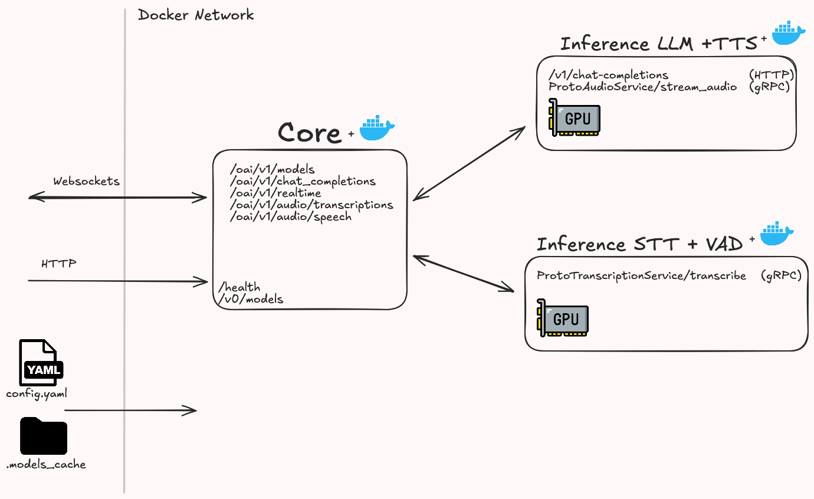

# Gateway: Local Voice-to-Voice AI Assistant
#### A latency-optimized, distributed audio pipeline implementing VAD + STT + LLM + TTS with an OpenAI-compatible API.
**[Documentation](#Documentation)** | **[Architecture](#Architecture)** | **[Demo](#Demo)** | **[Usage](#Usage)** | **[Roadmap](#Roadmap)** 

Note: this Repository is a mirror. Original Repository is being developed and store in my local Forgejo instance

### Features
- Async-rich latency-optimized voice-to-voice AI Assistant (VAD + STT + LLM + TTS)
- Real-time voice-to-voice, ability to interrupt what assistant says
- Exposing OpenAI-compatible endpoints for all running models (REST, Websockets)
- Launching models on-demand using YAML config file
- Distributed architecture (run models on different nodes)
- gRPC for communication between containers
- OpenWebUI on-demand


### Documentation
- **[README -- Development](README.dev.md)**

### Architecture




## Demo
#### HERE BE DRAGONS

## Usage

### Prerequisites
- Linux machine
- NVIDIA GPU, min 22Gb VRAM, CUDA 12 or higher
- Installed docker, docker compose, Nvidia container toolkit (ctk). See [guide.md](assets/docs/docker-docker-compose-ctl.md) to install

1. Clone the repository
    ```sh
    git clone https://app.git.valerii.cc/valerii/gateway.git
    cd gateway
    ```

2. Use config.yaml to configure running models \
**Note:** default config should suffice
    ```sh
    cp config.example.yaml config.yaml
    ```

3. Build Images
    ```sh
    sh run.dev.sh
    ```    

4. Start Containers 
    ```sh
    docker compose up -d
    ```

5. Navigate to [http://localhost:8000/docs](http://localhost:8000/docs) to access API documentation


## Roadmap
### HERE BE DRAGONS
